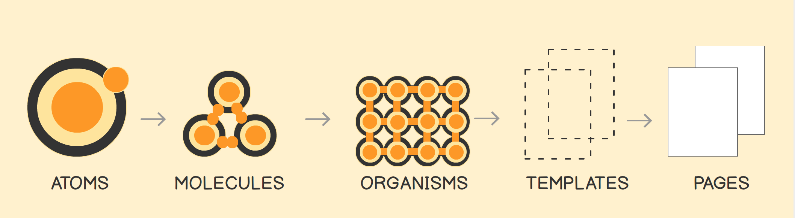
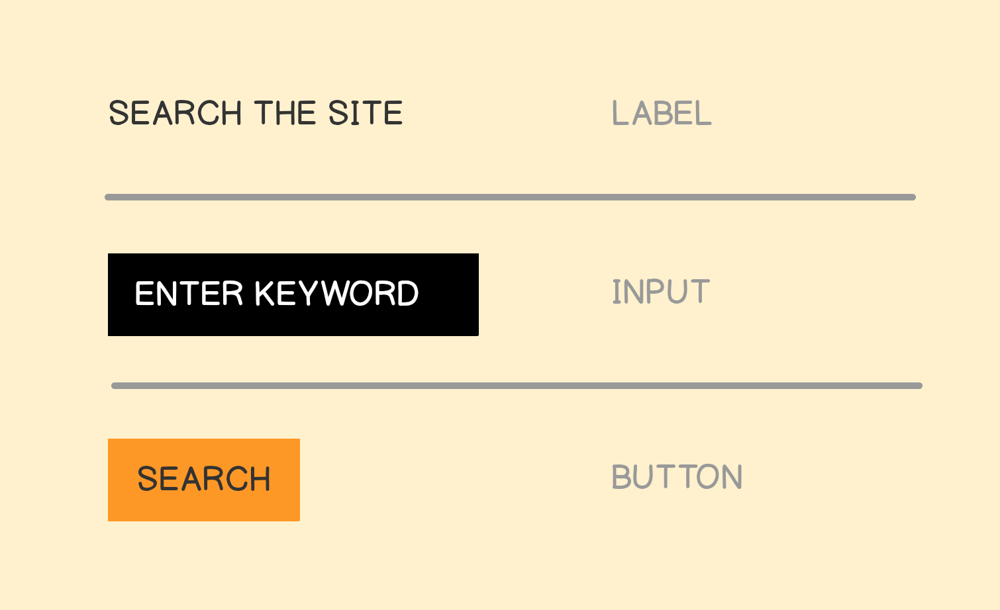
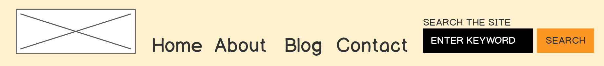
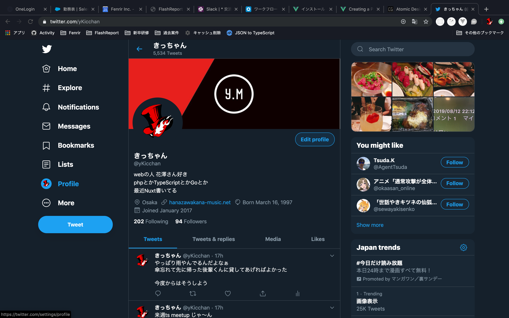
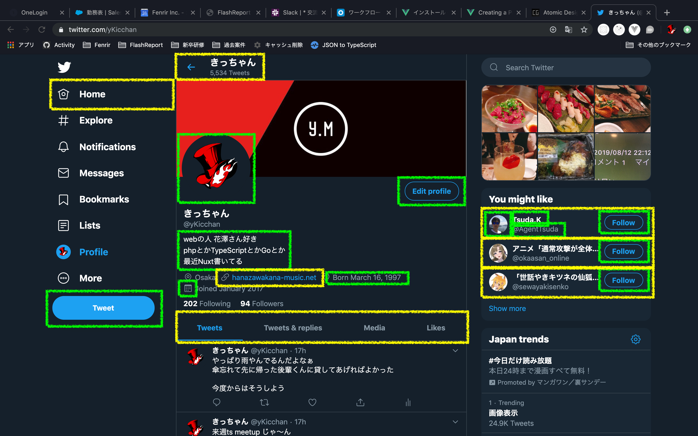
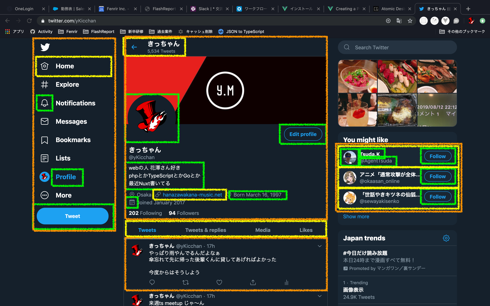

<!--
_backgroundColor: #000
_color: #fff
-->

# Atomic Design とは？

---

## コンポーネント指向

- UI を一つ一つ部品として作成
- 部品を再利用し、生産性を高める
- React, Vue は特に親和性が高い
- Atomic Design と考え方が近く、親和性が高い

---

## Atomic Design

以下の 5 種類に分けられる



---

## Atoms（原子）

UI部品における最小単位。
HTMLタグが基本になる。
アプリケーション固有の最小部品があれば定義する。

---



---

## Molecules（分子）

複数のAtomsから構成される部品。
Organismsと違って、独立して素材することはできず、
他の機能を助けるようなヘルパー的な役割を提供する。

- 検索フォーム
- ユーザー情報

---


---

## Organisms（有機体）

AtomsやOrganismsから構成される部品。
ページ固有になりがち。

- モーダル
- ヘッダー
- サイドバー

---



---

## Templates（テンプレート）

Webページのレイアウトを定義するもの。
テンプレートエンジンなどを利用して実現しているイメージに近い。

例えば大まかにAページには

- Header
- Sidebar
- Footer
- Contents

があるというような定義であるが、中身のないダミー情報のようなもの。

---

## Pages（ページ）

Templatesに部品を組み込んで、最終的なアウトプットとなるPage。

---



---


---



---



---


---

## ディレクトリ構成

```text
.
├── assets
├── atoms           // ←
├── environments
├── middleware
├── models
├── molecules       // ←
├── organisms       // ←
├── pages           // ←
├── plugins
├── store
├── templates       // ←
└── test
```

---

## ポイント

- Atoms
  - HTMLをラップするものではない
  - 命名・IF定義には最大の注意を払う
  - 標準に従う(Reactだと`children`, vueだと`v-model`や`slot`)
- Molecules
  - 命名・IF定義には最大の注意を払う
  - 標準に従う(Reactだと`children`, vueだと`v-model`や`slot`)
